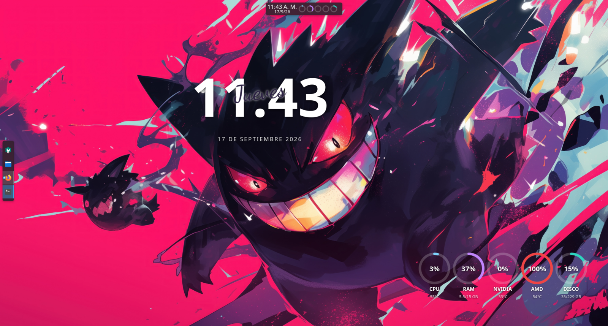

# KDE Plasma Widgets

Dos widgets para Plasma 6 pensados para usarse juntos en el escritorio: un reloj panorámico y un monitor del sistema, con una estética consistente (fondo transparente, tipografía en blanco con sombra para mantener el contraste sobre cualquier fondo de escritorio).



## Reloj Panorámico (`com.lucas.digitalclock`)

Reloj digital con la hora en grande, el día de la semana en cursiva superpuesto y la fecha debajo, todo en español.

- Formato de hora de 12 o 24 horas, con segundos opcionales.
- Separador de hora configurable (por defecto `.`, ej: `19.33`).
- Mostrar u ocultar la fecha y el día de la semana.
- Incluye la tipografía [Dancing Script](https://fonts.google.com/specimen/Dancing+Script) (licencia SIL Open Font License) para el día de la semana.

## Monitor del Sistema (`com.lucas.sysmonitor`)

Panel de métricas con anillos de progreso para CPU, RAM, GPU dedicada (NVIDIA), GPU integrada (AMD) y disco.

- Uso de CPU calculado en tiempo real a partir de `/proc/stat`.
- Temperatura de CPU vía `k10temp`/`coretemp` (lm-sensors).
- GPU dedicada vía `nvidia-smi` (uso, temperatura, VRAM).
- GPU integrada AMD vía `amdgpu` (lm-sensors) y `gpu_busy_percent` (sysfs).
- Uso de disco de la ruta que elijas (por defecto `/`).
- Representación compacta para el panel (anillos pequeños) con tooltip detallado al pasar el mouse, y representación completa para el escritorio.
- Diseño horizontal (fila) o vertical (columna) a elección, para acomodarlo mejor según el espacio del escritorio.
- Intervalo de actualización configurable.

### Requisitos

- `lm_sensors` (comando `sensors`) para las temperaturas.
- `nvidia-smi` si tenés GPU NVIDIA (opcional, el widget funciona sin ella).
- Un GPU AMD con driver `amdgpu` para la métrica de GPU integrada (opcional).

## Dock de Vidrio (`com.lucas.glassdock`)

Gestor de tareas para el panel con magnificación de iconos al pasar el mouse, al estilo del dock de macOS.

- Los iconos se agrandan según la distancia al puntero, con una curva coseno suave, y los vecinos se separan para acompañar el movimiento.
- El layout es función pura de la posición del puntero (se calcula sobre las celdas base, no sobre las ya escaladas), así que no hay realimentación ni temblor.
- El tamaño del applet no cambia durante la magnificación: el espacio del zoom queda reservado de antemano, por lo que no empuja al resto de los widgets del panel.
- El tamaño base del icono se limita solo para que el zoom nunca quede recortado contra el borde del panel.
- Lanzadores fijos y ventanas abiertas en la misma tira, con un punto indicador por cada ventana abierta (acotado a 3, para no saturar el borde) y atenuación de las minimizadas.
- Miniatura en vivo de las ventanas abiertas al pasar el mouse (vía PipeWire en Wayland, hasta 12 en una grilla de 4 columnas), con clic para saltar a la ventana; si el stream no está disponible cae al icono de la aplicación.
- Arrastrá un `.desktop` a un espacio vacío del dock para fijarlo como lanzador nuevo.
- Arrastrá archivos sobre un icono para abrirlos con esa aplicación; si te quedás encima sin soltar, la ventana se trae al frente (spring-loading) para soltar directamente adentro.
- Rebote continuo mientras una aplicación arranca (hasta que aparece su ventana), clic para activar/minimizar, clic con la rueda del medio para cerrar todas las ventanas de la app (o, sobre una miniatura, solo esa ventana) y menú contextual para fijar, desfijar o cerrar.
- Arrastrar un archivo sobre una app con varias ventanas abre un popup con todas para soltar directo en la que elijas; quedarte parado sobre una la trae al frente sin cerrar el popup, para soltar en la ventana real en vez de en la miniatura.
- En una app con varias ventanas, al quedarte parado sobre su icono empieza a mostrar una miniatura en vivo de cada ventana por turnos, en lugar del icono; clic para ir justo a la que se está mostrando. Desactivado por defecto.
- Insignia con las notificaciones sin leer de cada app (las que llegaron desde la última vez que la usaste) y barra de progreso de sus trabajos en curso: copias de Dolphin, descargas, etc. Se toman del servidor de notificaciones de Plasma.
- Indicador de audio sobre el icono de la app que está sonando, con clic para silenciarla o reactivar el sonido.
- Preferencias por app: clic derecho → "Sin insignias ni audio para esta app" excluye esa app puntual de ambas cosas, sin afectar al resto.
- Rueda del mouse sobre un icono para recorrer las ventanas de esa app, y atajos Meta+1…9 para activar la app según su posición (el widget declara `org.kde.plasma.multitasking`, que es lo que busca plasmashell para esos atajos).
- Reordenar los iconos arrastrándolos; el orden de las apps fijadas se guarda al soltar. Si sacás un lanzador fijo fuera del propio dock (por ejemplo hacia el dock de otra pantalla), pasa a ser un arrastre real del sistema: se fija en el dock donde lo sueltes y se quita del original.
- Publica la posición de cada icono a KWin, así la animación de minimizar (lámpara mágica, squash) va hacia el icono correcto.
- Funciona en paneles horizontales y verticales: el icono crece siempre hacia adentro desde el borde de la pantalla.
- Opción para ocultar el fondo del panel que lo contiene (panel completamente transparente, sin desenfoque), usando el mecanismo propio de Plasma (`backgroundHints: NoBackground` en el contenedor).
- Configurable: tamaño del icono, factor de magnificación, alcance, separación de vecinos, etiquetas y miniaturas al hover, rebote y filtros por escritorio o pantalla.

## Panel Transparente (`com.lucas.paneltransparente`)

Botón mínimo para el panel que alterna su transparencia total.

- Al activarlo, el contenedor del panel pasa a `backgroundHints: NoBackground` (mismo mecanismo que la opción equivalente de Dock de Vidrio), así que el panel queda sin fondo ni desenfoque.
- El icono cambia entre ojo abierto/tachado según el estado, y el estado se guarda en la configuración del widget.
- Sirve para cualquier panel, no requiere reemplazar el gestor de tareas por Dock de Vidrio.

## Velocidad de Red (`com.lucas.netspeed`)

Velocidad de bajada y subida en vivo, con mini gráfico de los últimos 60 muestreos.

- Lee los contadores de `/proc/net/dev`; por defecto usa la interfaz de la ruta por defecto (`ip route`), o la que indiques (ej. `wlan0`).
- Representación compacta para el panel (↓ y ↑ en dos líneas) y completa para el escritorio, con cambio automático por tamaño.
- Unidades automáticas (B/s, KB/s, MB/s, GB/s) y tooltip con la interfaz en uso.
- Configurable: interfaz, intervalo de actualización y mostrar/ocultar el gráfico.

## Instalación

Copiá cada carpeta a tu directorio de plasmoids de usuario:

```bash
cp -r com.lucas.digitalclock ~/.local/share/plasma/plasmoids/
cp -r com.lucas.sysmonitor ~/.local/share/plasma/plasmoids/
cp -r com.lucas.glassdock ~/.local/share/plasma/plasmoids/
cp -r com.lucas.paneltransparente ~/.local/share/plasma/plasmoids/
```

Reiniciá Plasma para que aparezcan en el selector de widgets:

```bash
plasmashell --replace &
```

Después, clic derecho en el escritorio (o en el panel) → **Agregar widgets** → buscá "Reloj Panorámico" o "Monitor del Sistema".

## Licencia

Código bajo licencia MIT (ver [LICENSE](LICENSE)). La tipografía Dancing Script incluida en `com.lucas.digitalclock/contents/fonts/` se distribuye bajo la SIL Open Font License 1.1 (ver el archivo `OFL.txt` en esa misma carpeta).
